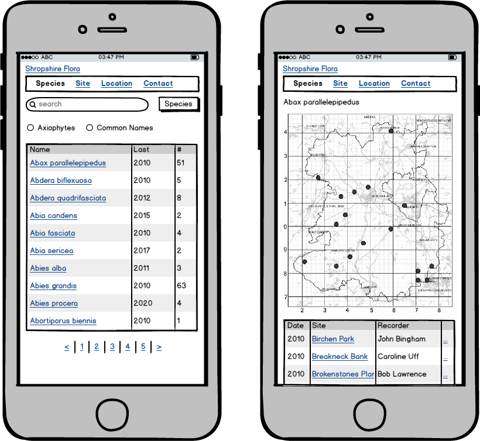

# Species

Search for a species based on the scientific name.

common name

show map

Map to show with current tetrad highlighted?

## Scenario: Field search for a species.

XXX User in the field.

Seen species and it is rare (not common).

Is it rare and where was it last seen
Then go to a map of sightings
and then press on dot to see records

Link to list of records with most recent 20 with dates and recorder name and grid and comment for background

Next leave or download as CSV on the phone to sort

Looking for in tetrad or site name

At that location in monad or tetrad.

Common name is aid memoire.  

No

When as it last recorded
and her

* How important is the record count
* Link to records or map
* Can we dump the common name?
* Two listings common names on or off
* What happens if there is no common name?

* Location detection.
* 

Wheresthemap

https://wtp2.appspot.com/wheresthepath.htm

Hand held = phone.

Objective

Location sp

## Scenario: Desktop search for a species.

XXX User desktop search.

At home.

Looking for where I was.  

Record of where I was, photo of specimen, 
National Grid is the reference point based on the GPS of the phone with 6 m

OS Grid Refernece.

Before visit

Boundaries of site

Want to know mon

Seen a rare speices.

Got home and want to see again.

Last 20 years of 

Date comparions

Specied compare.