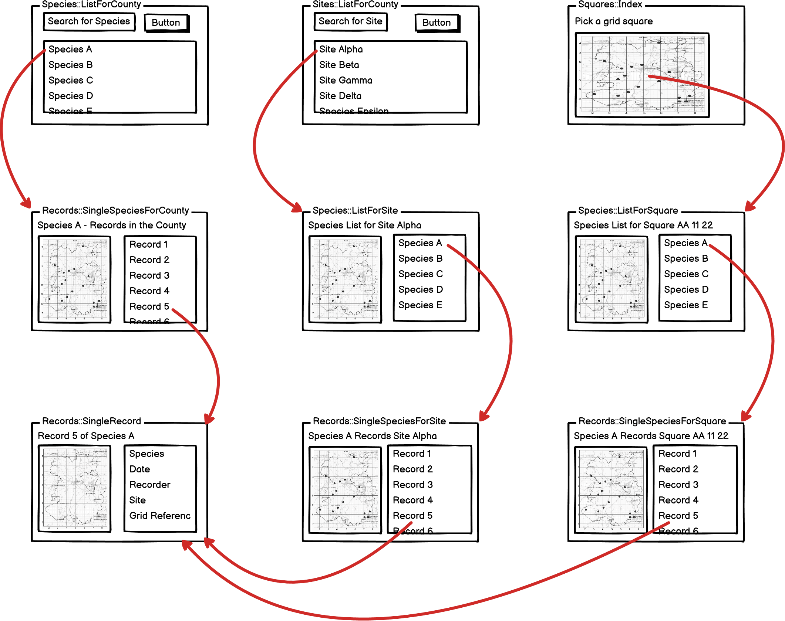
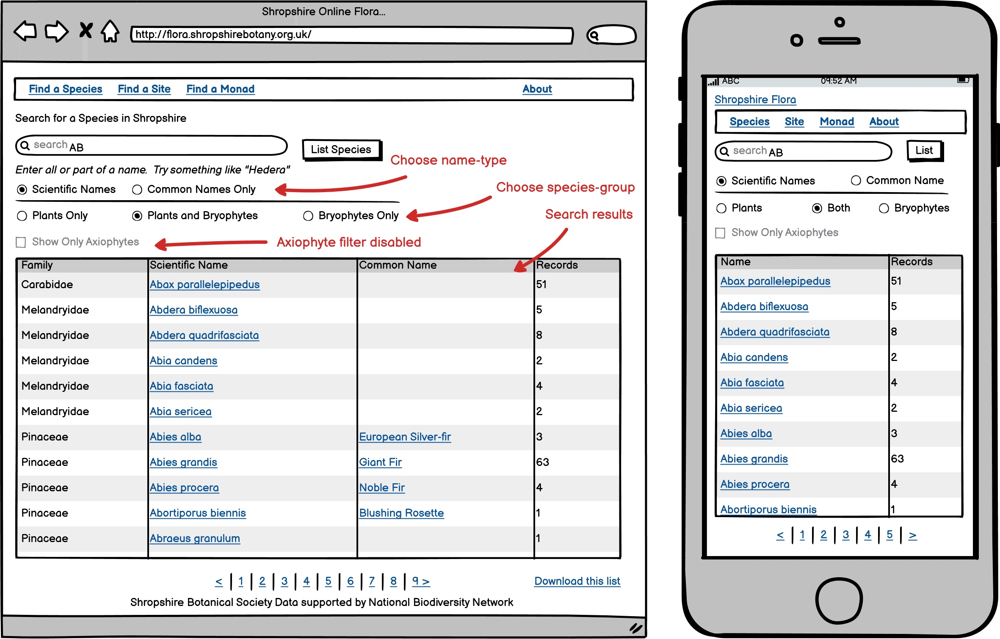
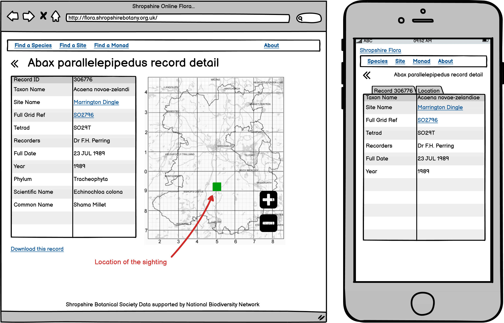
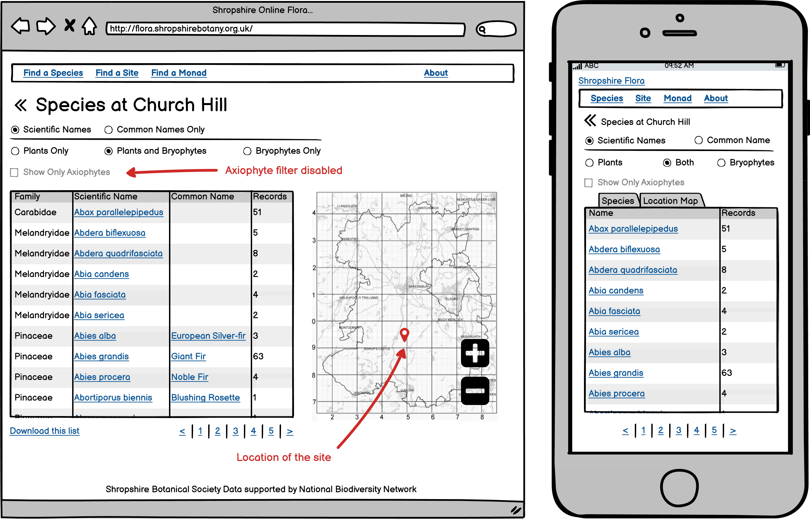
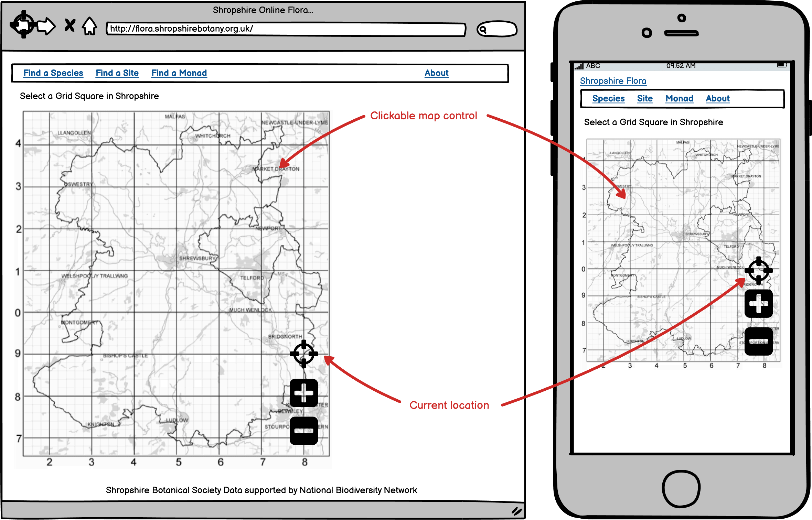
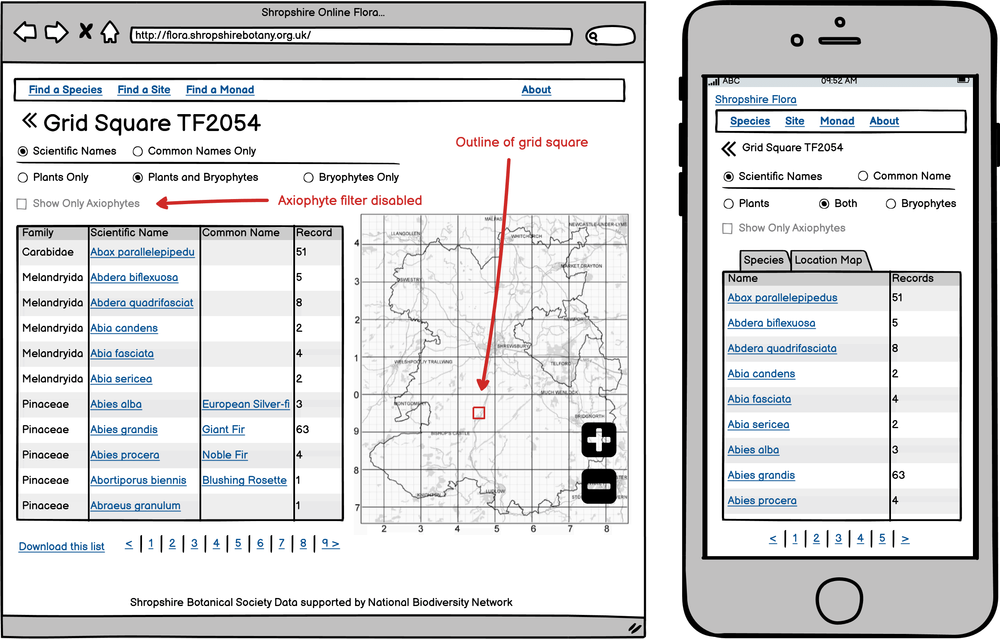
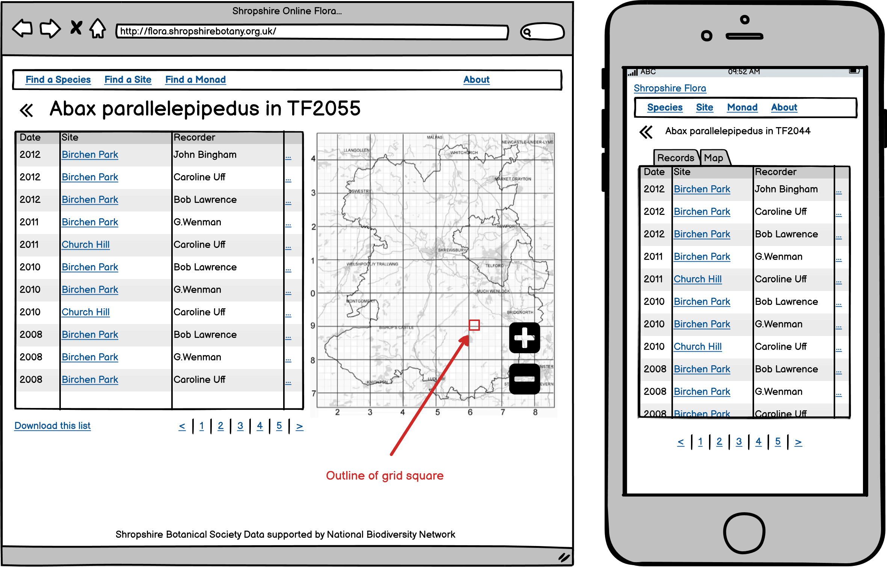

# Shropshire Botanical Society Online Flora Draft Specification  

The Shropshire Botanical Society is seeking to renew it's Online Flora web
application. This specification out lines the hoped for functionality together
with the technical and development constraints of the work.  

*Joe J Collins*

1. Background
==========

The Shropshire Botanical Society has been dedicated to promoting the enjoyment,
understanding and conservation of the flora of Shropshire since the 18^th^
century. One of the principle activities of the Society is to collect and
maintain records of plant sightings within the historical boundaries of the
county of Shropshire. Since 2003 the Society has made these records freely
available online via a bespoke web application or Online Flora. This original
Online Flora was written using PHP and the CodeIgniter Web Framework backed by a
MySql database. The web application is still available at
[captain-blue.azurewebsites.net](https://captain-blue.azurewebsites.net/) but
unfortunately the data is now many years out of date.

Maintaining and updating the database has proved to be challenging. Additionally
the application was conceived prior to the introduction of the iPhone and it not
suited to mobile use. Hence the Society seeks to renew the web application, to
provide a more modern mobile interface and to use up to date data stored by the
[National Biodiversity Network Atlas](https://nbnatlas.org/). Currently all the
Society's records are submitted to the National Biodiversity Network Atlas and
since 2017 the Society's records have been available via a web service at the
[NBN Web service API](https://api.nbnatlas.org/). Using the NBN Web service API
provides reliable data source and a supported service for maintaining and
updating the Society's records.

2. Objective
=========

To replicate the functionality of the original Online Flora in a responsive
mobile design using data sourced from the NBN Web service API.

The Online Flora is to be used for searching the Society's records but not for
entering new records. Maintaining and updating the data is conducted via a
separate manual process. Searches of the database are conducted for three
different geographical scenarios.

3. Overview
========

3.1. Users and Usage
---------------

Users of the Online Flora are typically members of the Society and as such are
often very experienced botanists. In a typical scenario a member of the Society
(intending to visit a location) would search for a list of species that have
previously been sighted at a location. It is the community or suite of species
at a location that is of most interest. For an experienced botanist a species
list for a location can provide information about the ecology, geology and
history of a location, but will also indicate what other species might be
present but have not yet been observed. Ideally the member of the Society would
also wish to drill down to see individual records of species sightings, with
dates, attributions and further details. This background will give a botanist
some insight about how much weight or credence can be given to individual
sightings.

3.2. Scenarios
---------

The Online Flora will serve three scenarios for searching for species lists.

**Search Shropshire** searching all the records of based on the name of the
plant. Allowing the user to drill down to a single sighting record or showing a
map of grid squares with records for a named plant.

**Search by Site** searching for a named site, then listing the names of plants
for that named site. Again allowing the user to drill down to a single sighting
record.

**Search by Monad or Grid Square** Selecting a 1 km grid square within the
county of Shropshire, then listing the names of plants for that named site.
Again allowing the user to drill down to a single sighting record.

These three scenarios are shown in the diagram below.

3.3. Categories of Plants
--------------------

Gaining experience identifying plants is a lifetimes work and members of the
Society will often focus their attention on one category of plants. So the
Society's observation records are separated into **vascular plants** and
**bryophytes**, (two categories within the kingdom of all plants). A member of
the Society will often wish to limit their searches to the category of plants
they are most interested in.

The concept of indicator species is highlighted by a list of plants referred to
as **axiophytes**. These are plants that are archetypical or axiomatic for a
particular ecological environment. So a member of the Society will often wish to
see only the axiophytes to gain a better understanding of the ecological
environment at a particular site.

The list of axiophytes is provided as a list of scientific species names. For
vascular plants this list was last updated in 2014. The list of axiophytes for
the bryophytes is currently being developed.

3.4. Data Storage
------------

The National Biodiversity Network Atlas (NBN) provides a service to maintain and
distribute biological records for the United kingdom. The Shropshire Botanical
Society contributes records to the NBN via the [Shropshire Ecological Data
Network](https://sites.google.com/view/sedn/home) (SEDN). So all the botanical
records for Shropshire are contained within the SEDN dataset on the NBN service
([dataset 782](occurrences/search?q=data_resource_uid%3Adr782)). There is a
regular(ish) process in place for passing updates to the NBN so new records are
added every 6 months or so.

The NBN provides a [specialized API](https://api.nbnatlas.org/) to query these
data which is based on Apache Solr. A [primer for how to use the
API](http://docs.shropshirebotany.org.uk/NBN%20Atlas%20Query%20Primer.pdf) is
provided by the NBN.

To improve performance queries should be cached on the server for about 30 days.

No data should be cached on the client device.

Offer 'Add to Home screen' on first and fifth visit.

3.5. Deliverables
------------

The work program is divided into four deliverables.

1.  Search in the County.

2.  Search at a Site.

3.  Search in a Square.

4.  Axiophyte Filtering.

The completion of the first deliverable, should provide a minimal working and
viable application. The subsequent deliverables should extend and enhance the
core application. The three scenarios are also the first three deliverables with
filtering on axiophytes as the last deliverable. It is intended that the
separate deliverables will provide convenient breakpoints for acceptance
testing, payments for work completed and opportunities to pause for reflection.

4. Deliverable 1: Search in the County
===================================

4.1. Species List for the County
---------------------------

### 4.1.1. 'Landing'

- [ ] Initially the search output should be empty.

- [ ] By default the **Scientific** name selected first, since botanists tend to
  favour identifying plant species via the scientific name.

- [ ] If **Common** is selected set a cookie to retain the user's choice of
  naming type.

- [ ] Also set a cookie for the user's choice of plant group (bryophytes or
  vascular plants).

### 4.1.2. Species Search

- [ ] The search is of the entire dataset for the county.

- [ ] The characters entered in the search box are used to search for names
  beginning with those letters, not within the names. [^1]

- [ ] Clicking on **List Species** or pressing return on the desktop list
  executes the search. If the search box is empty species beginning with 'A' are
  searched for.

- [ ] Any characters entered in the search box are retained after the button is
  clicked.

- [ ] The search results should be listed alphabetically by scientific name or
  common name, whichever is selected.

- [ ] If **Common** is selected, only the species with common names will be
  searched and shown. Any species without common names should not be included in
  the search results.

- [ ] Changing any radio button will renew the search using the changed set of
  parameters, without pressing return or clicking on the button.

- [ ] If the search result list is long pages links should be provided.

- [ ] The download link, downloads a zipped CSV of the search results directly
  from the NBN. [^2]

- [ ] Clicking on the scientific or common species name, takes you to a list of
  records for that species in the county.

4.2. Records for a Single Species in the County
------------------------------------------

### 4.2.1. Records List

- [ ] Title is the scientific name or common name depending on which was clicked
  on in the previous page.

- [ ] The `<<` goes back to the search for a species name using the same search
  parameters.

- [ ] The records are sorted by date, with most recent first. [^3]

- [ ] If the records list is long pages links should be provided.

- [ ] The download link, downloads a zipped CSV of the search results directly
  from the NBN.

- [ ] Site link goes to a list of records for the same species at the selected
  site.

- [ ] Square link goes to a list of records for the same species at the selected
  square.

### 4.2.2. Map

- [ ] Zoomable but not clickable.

- [ ] The records are in a hidden tab on mobile devices.

- [ ] Showing location of the site with a pin, since we don't have shape files
  for the sites, use the location of the first record.

- [ ] The map overlay comes from the NBN Web Mapping Service showing a
  distribution map of the species.

- [ ] Include an outline of the county.

4.3. A Single Record
---------------

### 4.3.1. Record Detail

- [ ] Title is the scientific name or common name depending on the previous
  page.

- [ ] The `<<` goes back to the records list for that species in the county.

- [ ] Show as much detail for the records as possible. [^4]

- [ ] Site link goes to a list of records for the same species at the selected
  site.

- [ ] Square link goes to a list of records for the same species at the selected
  square.

- [ ] The download link, downloads a zipped CSV of the search results directly
  from the NBN.

### 4.3.2. Map

- [ ] Zoomable but not clickable.

- [ ] In a hidden tab on mobile devices.

- [ ] The location of the record is marked with a square indicating the
  resolution of the grid reference.

5. Deliverable 2: Search at a Site
===============================

5.1. Site List for the County
------------------------

### 5.1.1. Sites Search

- [ ] Initially the search output should be empty.

### 5.1.2. Sites List {#sites-list .unnumbered}

- [ ] The characters entered in the search box are used to search for names
  beginning with those letters, not within the names. [^5]

- [ ] Clicking on **List Sites** or pressing return on the desktop list executes
  the search. If the search box is empty species beginning with 'A' are searched
  for.

- [ ] The sites should be ordered alphabetically by the site name (i.e. the
  'location\_id' field from the NBN records).

- [ ] Any characters entered in the search box are retained after the button is
  clicked.

- [ ] Clicking on the site name take you to a species list for that site.

5.2. Species List at a Site
----------------------

### 5.2.1. Species List

- [ ] Title is the name of the site clicked on in the previous page.

- [ ] The `<<` goes back to the previous search of site names.

- [ ] Changing any radio button will renew the search using the changed set of
  parameters.

- [ ] Radio button settings should be retained in a cookie. These values are the
  same as the ones used in the .

- [ ] Paging if the list exceeds 9 items.

### 5.2.2. Map {#map-2 .unnumbered}

- [ ] Initially showing the whole county.

- [ ] Zoomable but not clickable.

- [ ] In a hidden tab on mobile devices.

- [ ] Showing location of the site with a pin, since we don't have shape files
  for the sites, use the location of the first record of the first species.

5.3. Records for a Single Species at a Site
--------------------------------------

### 5.3.1. Records List

- [ ] Show records for that species at the selected site.

- [ ] Square link goes to a list of records for the same species at the selected
square.

### 5.3.2. Map

- [ ] Zoomable but not clickable.

- [ ] Showing the whole county.

- [ ] In a hidden tab on mobile devices.

- [ ] Showing location of the site with a pin, since we don't have shape files
  for the sites, use the location of the first record.

6. Deliverable 3: Search in a Square
=================================

6.1. Select a Square
---------------

6.2. Records for a Single Species in a Sguare
----------------------------------------

### 6.2.1. Map Control

- [ ] Initially showing the whole county.

- [ ] Zoom in and select a 1 km grid square.

- [ ] A 1 km graticule to appear when the squares are big enough (for selection
  with a finger).

- [ ] Retain map zoom and centre position between visits.

- [ ] The 'cross hair' icon to zoom to the current location using the browser
  Geolocation API.

6.3. Species List for a Square
-------------------------

### 6.3.1. Species List

- [ ] Title is the name of the square selected on in the previous page.

- [ ] The `<<` goes back to the map for selecting grid squares.

- [ ] Changing any radio button will renew the search using the changed set of
  parameters.

- [ ] Radio button settings should be retained in a cookie. These values are the
  same as the ones used in the .

- [ ] Paging if the list exceeds 9 items.

### 6.3.2. Map

- [ ] Zoomable but not clickable.

- [ ] Showing the whole county.

- [ ] In a hidden tab on mobile devices.

6.4. Records for a Single Species in a Square
----------------------------------------

### 6.4.1. Records List {#records-list-2 .unnumbered}

- [ ] Title is the name of the square and the species selected on in the
  previous page.

- [ ] The `<<` goes back to the species list for a grid square.

- [ ] Paging if the list exceeds 9 items.

### 6.4.2. Map

- [ ] Zoomable but not clickable.

- [ ] Showing the whole county.

- [ ] In a hidden tab on mobile devices.

7. Deliverable 4: Axiophytes
=========================

7.1. Enable Filtering and Display
----------------------------

- [ ] The diagram shows the species list for the county but axiophyte filtering
  should be enabled for all three scenarios.

- [ ] Species list for the county.

- [ ] Species list for a site.

- [ ] Species list in a square.

### 7.1.1. Axiophyte Indicator

- [ ] Axiophyte indicator next to the species for desktop and mobile devices.

### 7.1.2. Filtering Checkbox

- [ ] If **Axiophytes** is selected a limited static list of scientific names
  will be searched and shown.

- [ ] Check box settings should be retained in a cookie.

- [ ] If the check box (or the radio buttons) change the search should refresh.

8. Technical Constraints
=====================

The Botanical Society has limited means and wishes to ensure that the results of
any programming effort can be maintained and supported into the future, either
via an open source project or via the efforts of members of the Society. To
facilitate these possibilities the technical environment for the project is
intended to provide a low(ish) barrier to contributions.

**PHP 7.3** for deployment to Google App Engine for free hosting.

**CodeIgniter 4.0.4** has been used successfully in the past and provides long
term file caching.

**Twitter Bootstrap 4.5.2** for responsive layout.

**Leaflet 1.6.0** for interactive maps.

**Style Sheet** is taken from <https://www.shropshirebotany.org.uk/>. The Online
Flora is to be consistent with this website, so should where possible reuse the
same CSS classes and styles.

**No database** should be used other than the NBN Web service API, to keep down
maintenance costs. Any static data (such as the list of axiophytes) should be
hard coded into the application.

**Commits to Github** since the Society will retain the intellectual property
rights over any code produced. So all branching should be on the repository at
at <https://github.com/joejcollins/captain-magenta.git>.

**CI/CD** the develop branch deploys to <https://captain-magenta.azurewebsites.net/> on
Azure and will be used to review progress.

[^1]:[https://records-ws.nbnatlas.org/explore/group/Plants?fq=data_resource_uid:dr782+AND+taxon_name:B*](https://records-ws.nbnatlas.org/explore/group/Plants?fq=data_resource_uid:dr782+AND+taxon_name:B*)

[^2]:[https://records-ws.nbnatlas.org/occurrences/index/download?q=data_resource_uid:dr782&fq=taxon_name:A*&reasonTypeId=11&fileType=csv](https://records-ws.nbnatlas.org/occurrences/index/download?q=data_resource_uid:dr782&fq=taxon_name:A*&reasonTypeId=11&fileType=csv)

[^3]:[https://records-ws.nbnatlas.org/occurrences/search?q=data_resource_uid:dr782&fq=taxon_name:Abies%20alba&sort=taxon_name&fsort=index&pageSize=9](https://records-ws.nbnatlas.org/occurrences/search?q=data_resource_uid:dr782&fq=taxon_name:Abies%20alba&sort=taxon_name&fsort=index&pageSize=9)

[^4]:[https://records-ws.nbnatlas.org/occurrence/4276e1be-b7d2-46b0-a33d-6fa82e97636a](https://records-ws.nbnatlas.org/occurrence/4276e1be-b7d2-46b0-a33d-6fa82e97636a)

[^5]:[https://records-ws.nbnatlas.org/occurrences/search?fq=location_id:[Church%20TO%20*]&fq=data_resource_uid:dr782&facets=location_id&facet=on&pageSize=0](https://records-ws.nbnatlas.org/occurrences/search?fq=location_id:[Church%20TO%20*]&fq=data_resource_uid:dr782&facets=location_id&facet=on&pageSize=0)
